# Laporan Capstone by Machine Learning - Website CatCare
---

## Overview Proyek
---
Website CatCare merupakan sistem diagnosis penyakit kucing berbasis Machine Learning yang menyediakan dua metode input:

1. Deteksi penyakit kulit dari gambar
2. Prediksi penyakit dalam dari input teks/gejala

Sistem ini ditujukan untuk membantu pemilik kucing rumahan maupun penyelamat kucing liar dalam mengenali penyakit dan mendapatkan saran perawatan awal, terutama bagi mereka yang tidak memiliki akses ke dokter hewan atau belum memahami kondisi medis kucing.

### Latar Belakang

Menurut laporan Pet Keen (2024), populasi kucing liar dan domestik terus meningkat, namun kesadaran masyarakat akan kesehatan hewan peliharaan masih rendah, terutama dalam hal penyakit kulit dan penyakit dalam.

Sementara itu, banyak pemilik kucing merasa kesulitan untuk mengenali gejala penyakit, sehingga penanganan pertama sering terlambat. Dengan bantuan AI dan teknologi pengolahan citra serta teks, sistem CatCare dibangun untuk memberikan diagnosis cepat dan akurat, serta saran perawatan berdasarkan penyakit yang diprediksi.

### Tujuan Capstone
Pada Capstone ini memiliki beberapa tujuan diantaranya:
- Membangun sistem klasifikasi penyakit kulit kucing berbasis gambar dengan menggunakan deep learning.
- Membangun sistem prediksi penyakit berdasarkan input teks gejala menggunakan Algoritma Random Forest dan XGBoost.
- Menyediakan saran perawatan awal otomatis sesuai hasil prediksi.
- Memberikan edukasi kepada masyarakat awam yang tidak memahami penyakit kucing.
---

## Data Understanding
---
Pada bagian Data Understanding akan menjelaskan secara detail dari dataset yang digunakan, dimana ada 2 dataset yang digunakan yaitu untuk fitur gambar dan fitur input manual. Dataset dibedakan karena fitur yang berbeda dan bentuk dataset yang berbeda.

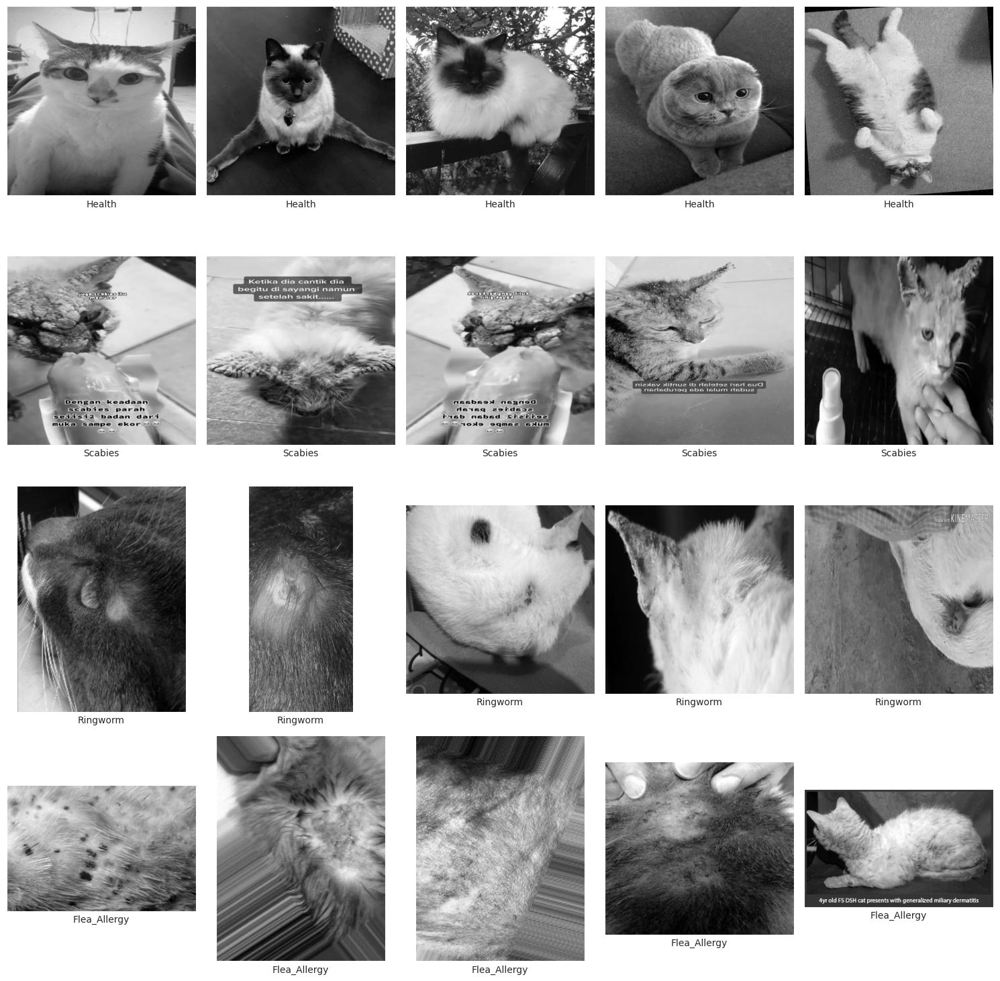

- Sumber: Kaggle
- Judul: Cat Skin Disease v2
- Link: https://www.kaggle.com/datasets/adityavahreza/cat-skin-disease-v2
- Kelas: Flea_Allergy, Health, Ringworm, Scabies

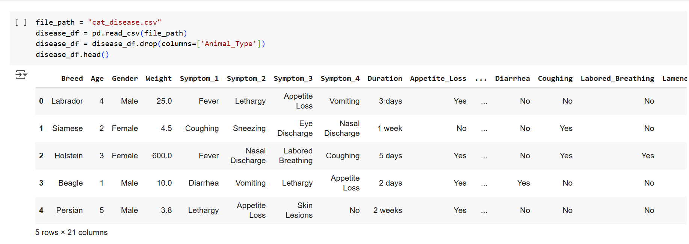

- Sumber: Kaggle
- Judul: Animal Disease Prediction
- Link: https://www.kaggle.com/datasets/shijo96john/animal-disease-prediction
- Fitur: Symptoms, Disease, Description, Treatment

---
## Data Preparation
---

### Model Gambar
- Dataset awal berupa struktur folder CAT SKIN DISEASE/<label>/<gambar> dikumpulkan dengan os.walk dan dikonversi menjadi DataFrame berisi path, file name, dan label.
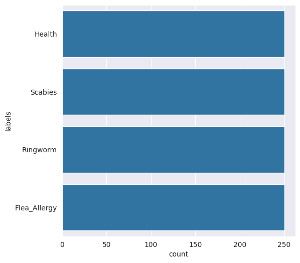

- Data dibagi menggunakan train_test_split sebanyak 80% data latih dan 10% validasi, 10% pengujian.
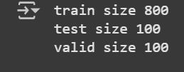

- File disalin ke dalam struktur baru Dataset-Final/<train|test|validation>/<label> menggunakan shutil.copy2 agar lebih rapi.

- Augmentasi data dilakukan dengan ImageDataGenerator menggunakan teknik:

    - Rescale piksel: 1./255
    - Rotation range: 20 derajat
    - Width & height shift: 10%
    - Zoom & shear transform
    - Horizontal flip & padding fill_mode

- Ukuran gambar disesuaikan ke (150,150) sesuai input MobileNetV2.

- Data generator dibentuk dengan flow_from_directory() untuk training, validation, dan testing.

### Model Input 

- Dataset dari file CSV diperiksa untuk mengetahui jumlah baris, kolom, dan missing value.

- Visualisasi dilakukan:

    - Histogram dan boxplot untuk kolom numerik Age, Weight dan Heart_Rate
    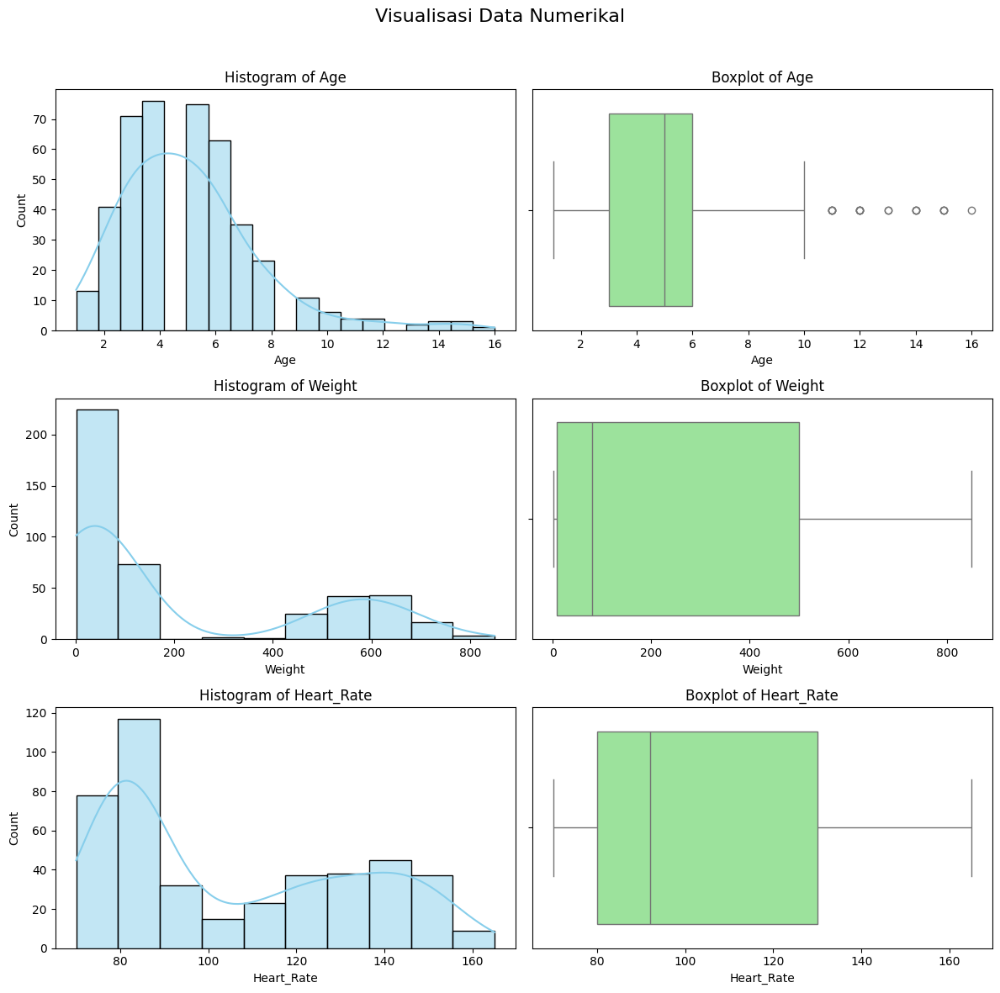

    - Countplot untuk variabel kategorikal Breed, Gender, Symptom_1, Symptom_2, Symptom_3, Symptom_4, Duration, Appetite_Loss, Vomiting, Diarrhea, Coughing, Labored_Breathing, Lameness, Skin_Lesions, Nasal_Discharge, Eye_Discharge, Body_Temperature, Disease_Prediction
    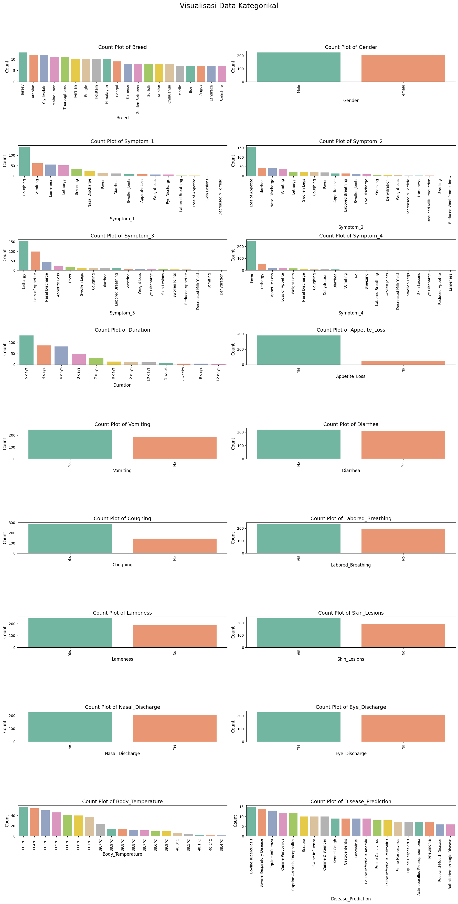

    - Pairplot untuk hubungan antar variabel numerik
    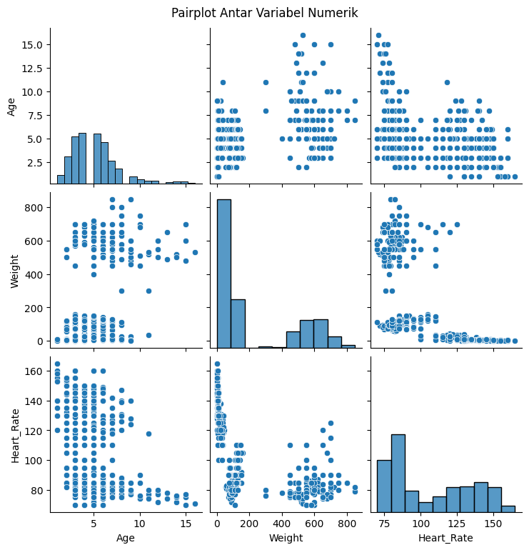

- Proses preprocessing:

    - Mapping nilai kategorikal ke numerik seperti Gender, Yes/No gejala

    - Label encoding untuk kolom seperti Breed, Symptom_1 hingga Disease_Prediction

- Dataset akhir disiapkan untuk modeling berbasis algoritma klasik (Random Forest, XGBoost).

- Proses Data Preparation Dataset Teks:

    - Preprocessing: lowercase, tokenisasi, padding
    - Label encoding untuk penyakit
    - TF-IDF vectorizer dan one-hot encoding

---
## Modelling
---

### Model Gambar (Penyakit Kulit)

- Framework: TensorFlow + Keras
- Arsitektur: Transfer Learning dengan MobileNetV2 sebagai feature extractor
- Layer tambahan: CNN, BatchNormalization, Flatten, Dense
- Output: 4 kelas penyakit (softmax activation)
- Loss: categorical_crossentropy
- Optimizer: Adam (lr=1e-4)

Cara Kerja:
MobileNetV2 adalah model CNN ringan yang dilatih sebelumnya pada ImageNet. Dalam proyek ini, bagian awal model digunakan sebagai feature extractor, kemudian ditambahkan layer CNN dan dense untuk klasifikasi 4 kelas penyakit kulit. Model dilatih dengan augmentasi data agar lebih generalis.

Kelebihan:

- Akurasi tinggi meskipun data terbatas
- Latihan cepat karena pretrained model
- Efisien dan cocok untuk deployment

Kekurangan:

- Tidak cocok untuk input non-gambar
- Performa bisa menurun jika kualitas gambar buruk

### Model Teks (Gejala Penyakit Dalam)

1. Algoritma 1: RandomForestClassifier
    - Fitur: TF-IDF dari input teks gejala
    - Output: Prediksi penyakit dan saran perawatan

        Cara Kerja Random Forest:
        Random Forest adalah algoritma ensemble yang membangun banyak pohon keputusan secara acak dan mengambil hasil mayoritas. Cocok untuk data tabular dan klasifikasi gejala karena mampu menangani berbagai fitur dan mencegah overfitting dengan averaging.

        Kelebihan Random Forest:

        - Stabil dan tahan terhadap overfitting
        - Menangani fitur yang tidak linier
        - Tidak sensitif terhadap outlier

        Kekurangan Random Forest:

        - Ukuran model besar
        - Interpretasi model tidak sesederhana decision tree

2. Algoritma 2: XGBoostClassifier
    - Fitur: TF-IDF dari input teks gejala 
    - Output: Prediksi penyakit dan saran perawatan
    Cara Kerja XGBoost:
    XGBoost adalah metode boosting berbasis gradient yang membangun pohon keputusan secara bertahap, memperbaiki error dari model sebelumnya. Dikenal sangat efisien dan akurat pada data tabular.

        Kelebihan XGBoost:

        - Akurasi tinggi
        - Mendukung paralelisasi
        - Dapat mengatasi missing value

        Kekurangan XGBoost:

        - Butuh tuning parameter
        - Risiko overfitting jika tidak dikontrol

---
## Evaluation
---
Pada tahap ini evaluasi dibedakan menjadi dari 3 algoritma, dimana model input menggunakan Akurasi Test dan F1-Score sedangkan model gambar menggunakan Akurasi Test saja.

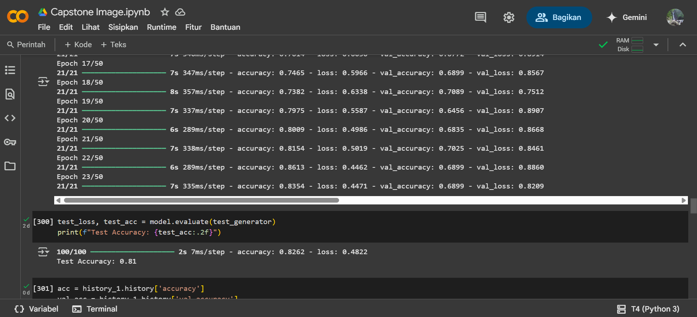

- Test Accuracy: 81.26%
- Test Loss: 0.4822

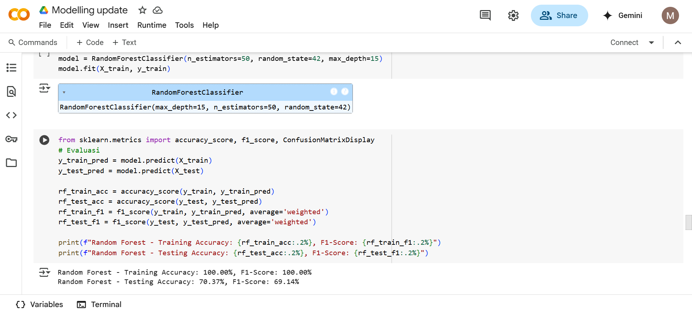

- Random Forest:
    - Accuracy: 70.37%
    - F1-Score: 69.14%

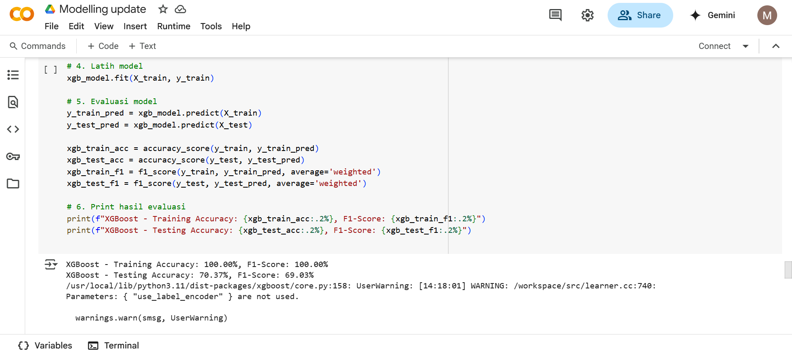

- XGBoost:
    - Accuracy: 70.37%
    - F1-Score: 69.03%

Tabel Ringkasan:

| Model              | Metode        | Test Accuracy | F1 Score |
| ------------------ | ------------- | ------------- | -------- |
| Model Gambar       | TensorFlow   | **81.26%**    | -        |
| Model Input Gejala | Random Forest | 70.37%        | 69.14%   |
| Model Input Gejala | XGBoost       | 70.37%        | 69.03%   |

### Hasil Diagnosa dan Saran Perawatan
Berikut merupakan hasil testing dari Model input gambar yang sudah diuji dalam notebook.

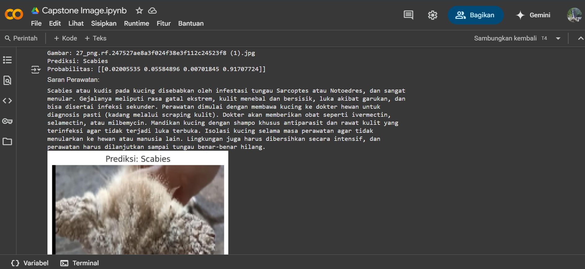

- Input: Foto kulit kucing

- Prediksi: Scabies

- Saran:

    Scabies atau kudis pada kucing disebabkan oleh infestasi tungau Sarcoptes atau Notoedres, dan sangat menular. Gejalanya meliputi rasa gatal ekstrem, kulit menebal dan bersisik, luka akibat garukan, dan bisa disertai infeksi sekunder. Perawatan dimulai dengan membawa kucing ke dokter hewan untuk diagnosis pasti (kadang melalui scraping kulit). Dokter akan memberikan obat seperti ivermectin, selamectin, atau milbemycin. Mandikan kucing dengan shampo khusus antiparasit dan rawat kulit yang terinfeksi agar tidak terjadi luka terbuka. Isolasi kucing selama masa perawatan agar tidak menularkan ke hewan atau manusia lain. Lingkungan juga harus dibersihkan secara intensif, dan perawatan harus dilanjutkan sampai tungau benar-benar hilang.

---
## Kesimpulan
---
Website CatCare berhasil menggabungkan dua model berbasis AI:

- Model gambar untuk penyakit kulit dengan akurasi tinggi (81%)
- Model teks untuk penyakit dalam kucing dengan akurasi 70%

Keduanya menghasilkan saran perawatan otomatis yang dapat membantu pemilik hewan dalam memberikan penanganan awal. Sistem ini relevan digunakan baik untuk masyarakat umum, penyayang hewan, maupun relawan penyelamat kucing jalanan.

---
## Referensi
---
[1] VCA Hospitals - Cat Skin Diseases: https://vcahospitals.com/know-your-pet/skin-diseases-in-cats

[2] PetKeen - Feral Cat Statistics: https://petkeen.com/feral-cat-statistics/

[3] TensorFlow - MobileNetV2 Docs: https://www.tensorflow.org/api_docs/python/tf/keras/applications/MobileNetV2

[4] scikit-learn RandomForest: https://scikit-learn.org/stable/modules/generated/sklearn.ensemble.RandomForestClassifier.html

[5] XGBoost Documentation: https://xgboost.readthedocs.io/en/stable/